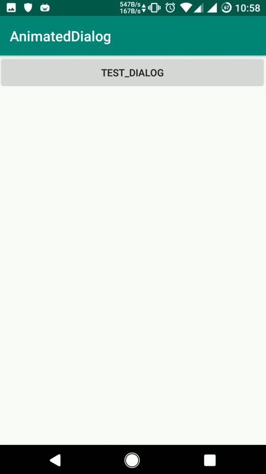

# AnimatedDialog

附带基础入场离场动画的dialog，减少重复代码

## 效果 ##

## 使用 ##

### 引入到工程 ###

#### Step 1. Add the JitPack repository to your build file

Add it in your root build.gradle at the end of repositories:

	allprojects {
		repositories {
			...
			maven { url 'https://jitpack.io' }
		}
	}

#### Step 2. Add the dependency ####

	dependencies {
    	implementation  'com.github.jianyuyouhun:AnimatedDialog:1.0.3'
	}

### 使用 ###

1、默认配置注解 

	@AnimatorConfig(
	    contentGravity = ContentViewGravity.BOTTOM,//默认为CETNER
	    enterType = EnterAnimationType.FROM_DOWN,//默认为FADE_IN
	    exitType = ExitAnimationType.TO_DOWN,//默认为FADE_OUT
		animatorCreator = DefaultAnimatorCreator::class//默认为DefaultAnimatorCreator
	)
	class TestDialog(
	    context: Context,
	    style: Int = R.style.AnimatedDialogTheme//可传递其他style来修改主体，默认主题为全屏模式
	) : BaseAnimatedDialog(
	    context,
	    style
	) {
	    override fun getLayoutId(): Int = R.layout.dialog_test
	}

ContentViewGravity定义：
	
	
    enum class ContentViewGravity {
        TOP,
        CENTER,
        BOTTOM,
        LEFT,
        RIGHT
    }

EnterAnimationType定义：

    enum class EnterAnimationType {
        FROM_DOWN,//从下方进入
        FROM_UP,//从上方进入
        FROM_LEFT,//从左侧进入
        FROM_RIGHT,//从右侧进入
        FADE_IN,//淡入
    }

ExitAnimationType定义：

    enum class ExitAnimationType {
        TO_DOWN,//下方离场
        TO_UP,//上方离场
        TO_LEFT,//左侧离场
        TO_RIGHT,//右侧离场
        FADE_OUT,//淡出
    }

2、自定义动画配置

实现AnimatorCreator接口。比如要增加折叠动画，则可以重写一个ScaleAnimatorCreator

	class ScaleAnimatorCreator : AnimatorCreator {
	    override fun onCreateEnterAnimator(
	        animatorView: View,
	        attr: AnimatorAttr,
	        enterAnimationType: EnterAnimationType
	    ): List<Animator> {
	        var animator1: Animator? = null
	        var animator2: Animator? = null
	        when (enterAnimationType) {
	            EnterAnimationType.FROM_UP,
	            EnterAnimationType.FROM_DOWN -> {
				//                animator1 = ObjectAnimator.ofFloat(animatorView, View.TRANSLATION_Y, attr.fromY, attr.toY)
	                animator2 = ObjectAnimator.ofFloat(animatorView, View.SCALE_Y, 0F, 1F)
	            }
	            EnterAnimationType.FROM_LEFT,
	            EnterAnimationType.FROM_RIGHT -> {
				//                animator1 = ObjectAnimator.ofFloat(animatorView, View.TRANSLATION_X, attr.fromX, attr.toX)
	                animator2 = ObjectAnimator.ofFloat(animatorView, View.SCALE_X, 0F, 1F)
	            }
	            EnterAnimationType.FADE_IN -> {
	                animator1 = ObjectAnimator.ofFloat(animatorView, View.ALPHA, 0F, 1F)
	            }
	        }
	
	        return if (animator1 == null && animator2 == null) {
	            emptyList()
	        } else if (animator1 == null) {
	            arrayListOf(animator2!!)
	        } else if (animator2 == null) {
	            arrayListOf(animator1)
	        } else {
	            arrayListOf(animator1, animator2)
	        }
	    }
	
	    override fun onCreateExitAnimator(
	        animatorView: View,
	        attr: AnimatorAttr,
	        exitAnimationType: ExitAnimationType
	    ): List<Animator> {
	        var animator1: Animator? = null
	        var animator2: Animator? = null
	        when (exitAnimationType) {
	            ExitAnimationType.TO_UP,
	            ExitAnimationType.TO_DOWN -> {
				//                animator1 = ObjectAnimator.ofFloat(animatorView, View.TRANSLATION_Y, attr.fromY, attr.toY)
	                animator2 = ObjectAnimator.ofFloat(animatorView, View.SCALE_Y, 1F, 0F)
	            }
	            ExitAnimationType.TO_LEFT,
	            ExitAnimationType.TO_RIGHT -> {
				//                animator1 = ObjectAnimator.ofFloat(animatorView, View.TRANSLATION_X, attr.fromX, attr.toX)
	                animator2 = ObjectAnimator.ofFloat(animatorView, View.SCALE_X, 1F, 0F)
	            }
	            ExitAnimationType.FADE_OUT -> {
	                animator1 = ObjectAnimator.ofFloat(animatorView, View.ALPHA, 1F, 0F)
	            }
	        }
	        return if (animator1 == null && animator2 == null) {
	            emptyList()
	        } else if (animator1 == null) {
	            arrayListOf(animator2!!)
	        } else if (animator2 == null) {
	            arrayListOf(animator1)
	        } else {
	            arrayListOf(animator1, animator2)
	        }
	    }
	}

然后修改AnimatorConfig的animatorCreator = ScaleAnimatorCreator::class

就可以实现折叠效果了

**ScaleAnimatorCreator代码在demo中**

### 一些配置 ###

1、 修改背景颜色

	bgColor = Color.parseColor("#55000000")//kotlin中
	setBgColor(Color.parseColor("#55000000"))//java中

2、 修改动画时长

	animationDuration = 300L //kotlin中
	setAnimationDuration(300) //java中
